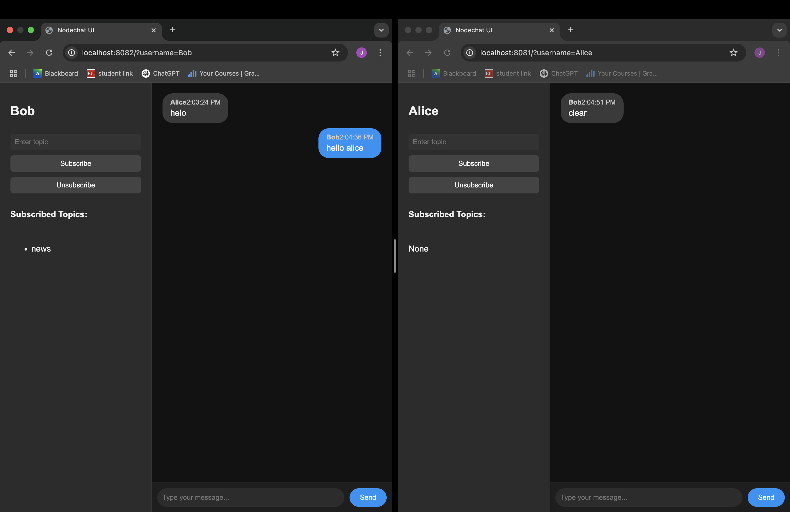
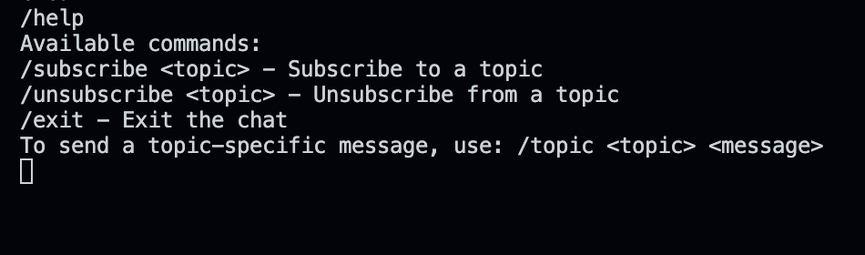
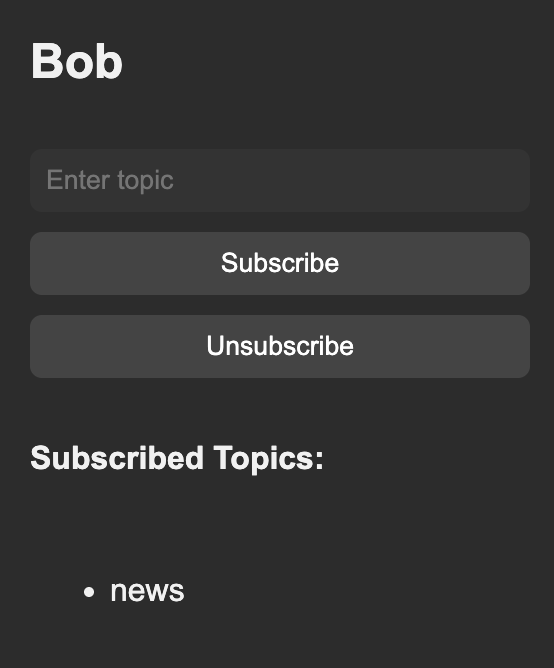

# NodeChat
By Joshua Arrevillaga

## Overview
Nodechat is a real-time peer-to-peer chat application built with **Go** for the backend and **React** for the frontend. It allows users to connect to specific peers, exchange messages, and subscribe to specific topics. This application uses **SQLite** for local message storage and topic-based subscription management.

## Setup Instructions

### Prerequisites
- **Go**: Version 1.18+
- **Node.js**: Version 18+
- **SQLite**: Installed and configured

### Backend Setup (from root)
Start a peer:
```bash
go run cmd/peer/main.go --port=<listening port> --username=<username> --api-port=<api port>

Connecting to a peer:
go run cmd/peer/main.go --port=<listening port> --username=<username> --api-port=<api port> --connect=<IP of peer>

### Frontend 

cd ui
npm run build

## Usage 

This is how the UI looks after running



In the terminal you can use /help to repeat the use cases:



To subscribe to specific topics, go to the top left bar and input the topic you want to subscribe to.



To send topic based messages in the main chat run /topic <topic> message

Likewise to unsubscribe.

