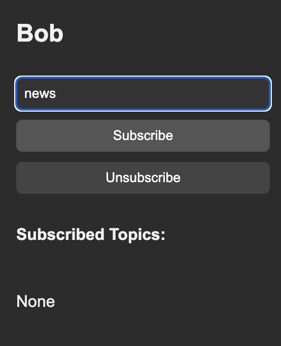

# NodeChat
By Joshua Arrevillaga

## Overview
Nodechat is a real-time peer-to-peer chat application built with **Go** for the backend and **React** for the frontend. It allows users to connect to specific peers, exchange messages, and subscribe to specific topics. This application uses **SQLite** for local message storage and topic-based subscription management.

## Setup Instructions

### Prerequisites
- **Go**: Version 1.18+
- **Node.js**: Version 18+
- **SQLite**: Installed and configured
- Podman or Docker

## Building Locally

### Backend Setup (from root)
Start a peer:
```bash
go run cmd/peer/main.go --port=<listening port> --username=<username> --api-port=<api port>
```
Connecting to a peer:
```bash
go run cmd/peer/main.go --port=<listening port> --username=<username> --api-port=<api port> --connect=<IP of peer>
```

### Frontend 

```bash
cd ui
npm run build
```

## Containerization with Podman
1. Build the image
```bash
podman build -t nodechat:latest . 
```

2. Run peer A (ex. alice)
```bash
podman rm -f alice 2>/dev/null
podman run -d --name alice \
  --network host \
  -v nodechat_uploads:/app/uploads \
  -v nodechat_db:/app/databases \
  nodechat:latest \
    --port=9000 --api-port=8080 --username=alice
```

<p> Alice will listen on host port 9000 for P2P and 8080 for HTTP/UI </p>


3. run peer B (ex. bob)
```bash 
podman rm -f bob 2>/dev/null
podman run -d --name bob \
  --network host \
  -v nodechat_uploads:/app/uploads \
  -v nodechat_db:/app/databases \
  nodechat:latest \
    --port=9001 --api-port=8081 --username=bob \
    --connect=localhost:9000
```

<p> Bob will listen on ports 9001 and 8081, connects to alice at localhost:9000</p>

## Usage 

This is how the UI looks after running

<p align="center">
  
</p>

In the terminal you can use /help to repeat the use cases:

<p align="center">
  
</p>


To subscribe to specific topics, go to the top left bar and input the topic you want to subscribe to.

<p align="center">
  
</p>


To send topic based messages in the main chat run /topic topic_name message

Likewise to unsubscribe.

<p align="center">
  
</p>
