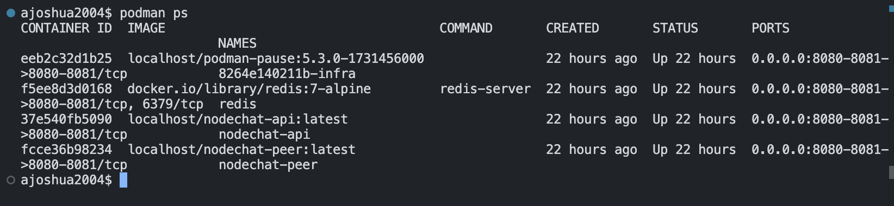
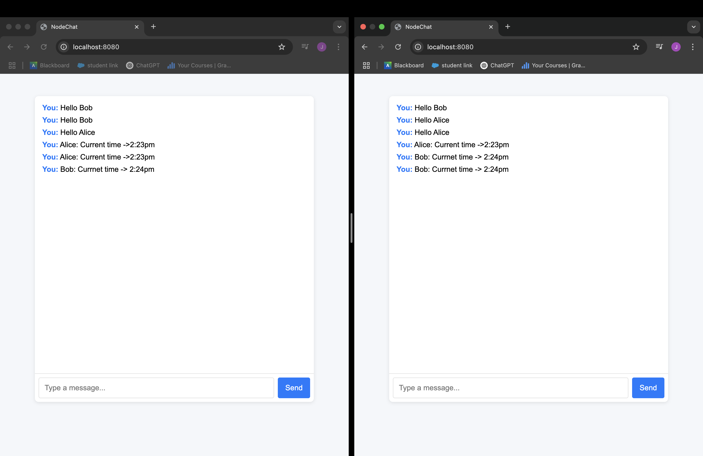
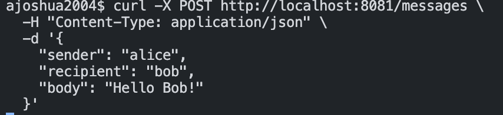
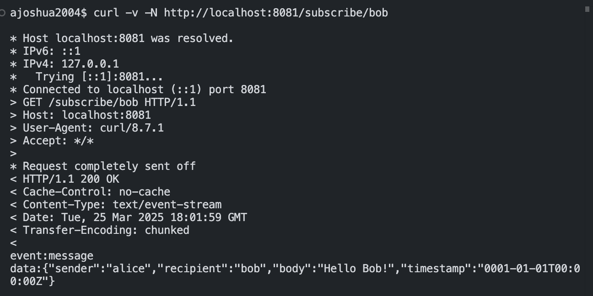

# NodeChat
By Joshua Arrevillaga

## Setup and Installation
### Prerequisites

* Podman
* Podman Compose
* Redis
* Go 1.20+
* Node.js

### Setup

1. git clone https://github.com/yourusername/nodechat.git
   cd nodechat

2. podman build -t nodechat -f Containerfile .

3. podman-compose up --build

4. podman ps

## Podman Use

The project is fully containerized using Podman, which should ensure it should run consistently on most environments. I have two containerfiles, one for the peer to peer requirement and one for the api messaging system via redis. I also use a docker-compose.yml to orchestrate the services

* Redis: Used as a message broker for pub/sub communication, 

* nodechat-peer: peer to peer messaging server that listens for Websocket connections, accessed at http://localhost:8080

* nodechat-api: API based messaging server utilizing redis for real timer messaging, runs on port 8081

## Phase 1: Peer to Peer Messaging

For Peer-to-Peer, the server listens for WebSocket connections and serves a React UI at http://localhost:8080. You can open multiple browser tabs to simulate different clients and send messages in real time. The UI, served as static files by the peer server, allows for a graphical interface, replacing the need for terminal-based communication.

## Phase 2: API Messaging

This phase involves transitioning to an API-based system that leverages Redis pub/sub and Server Sent Events (SSE) for real time communication.

* POST /messages: Accepts a json input and publishes it on the recipient's redis channel

* GET /subscribe/:userID: Establishes an SSE connection to stream real time messages to a specific user

* Using Redis pub/sub lets us route messages without storing data on a central server. local data remains on client devices. 

### Health Check 
curl http://localhost:8081/health

expected output: 
{"status": "ok"}

### Subscribe to Messages
curl -v -N http://localhost:8081/subscribe/bob

### Sending a message
curl -X POST http://localhost:8081/messages \
  -H "Content-Type: application/json" \
  -d '{
    "sender": "alice",
    "recipient": "bob",
    "body": "Hello Bob!"
  }'

expected output: 
event:message
data:{"sender":"alice","recipient":"bob","body":"Bob fuck off!","timestamp":"0001-01-01T00:00:00Z"}

## Future Features

* Create a UI for the API Messaging

* User registration and authentication

* Local storage for offline access

* Remove P2P and fully replace with API Messaging
